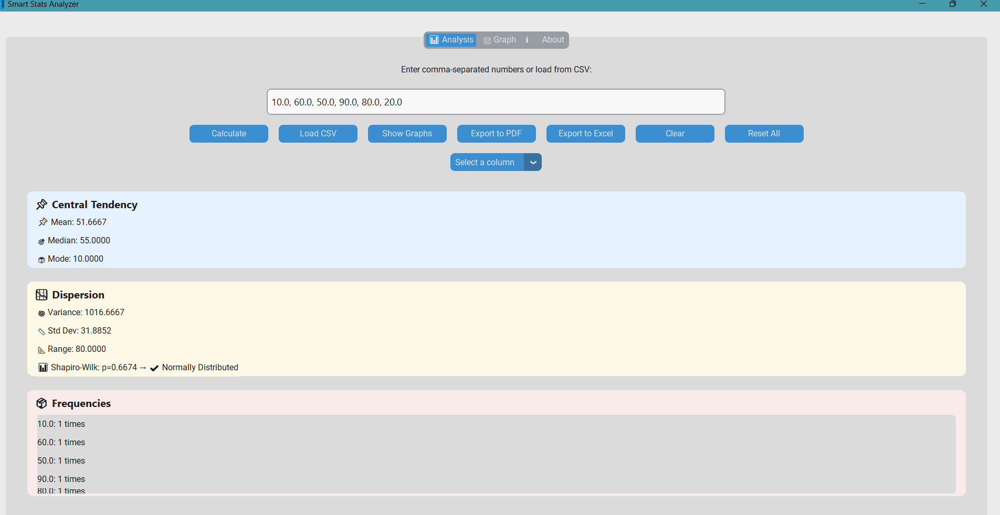
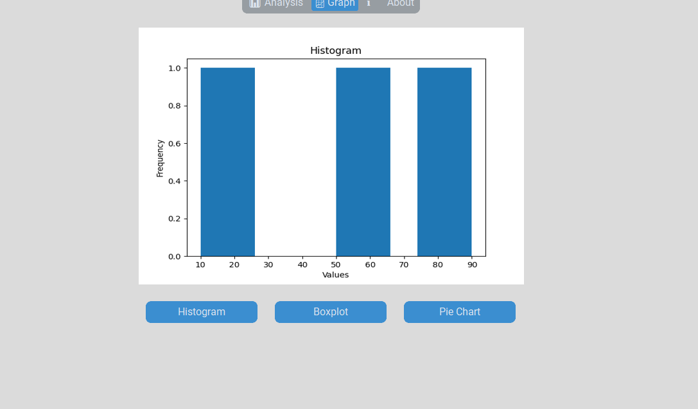
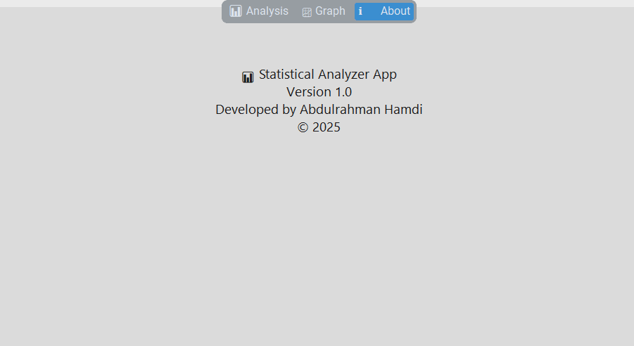

# 📊 Smart Stats Analyzer

**Smart Stats Analyzer** is a modern and intuitive desktop application built with Python and CustomTkinter that allows users to perform quick and insightful statistical analysis on numerical data. Whether you're a student, data analyst, or educator, this app is designed to help you explore your datasets with ease.

---

## 🖼️ Screenshots

### Dashboard — Analysis View

<p align="center">
  
</p>

---

### Graphs — Boxplot

<p align="center">
  
</p>

---

### About — Tap

<p align="center">
  
</p>


---

## 🚀 Features

✅ Load data manually or from `.csv`, `.xlsx`, `.json`, or `.txt` files\
✅ Auto-statistics (mean, median, mode, variance, std dev, range)\
✅ Shapiro-Wilk test to check for normal distribution\
✅ Frequency analysis\
✅ Visualizations: Histogram, Boxplot, Pie Chart\
✅ Export reports to **PDF** and **Excel**\
✅ Toggle between Light/Dark mode\
✅ Smart UI with Reset and Clear functions\
✅ Auto-save & session resume feature

---

## 🧠 How It Works

1. **Enter Numbers** manually in the input box (e.g. `10, 20, 30`) or load a dataset from file.
2. The app instantly calculates:
   - Central Tendency: mean, median, mode
   - Dispersion: variance, standard deviation, range
   - Normality test via Shapiro-Wilk
3. Displays frequency distribution.
4. Choose between different graph types.
5. Export the analysis to **PDF** (with chart) or **Excel**.

---

## 🛠️ Built With

- [Python 3.11+](https://www.python.org/)
- [CustomTkinter](https://github.com/TomSchimansky/CustomTkinter)
- [matplotlib](https://matplotlib.org/)
- [pandas](https://pandas.pydata.org/)
- [scipy](https://scipy.org/)
- [FPDF](https://py-pdf.github.io/fpdf2/)

---

## 📦 Packaging to .exe

You can package the app using `PyInstaller`:

```bash
pip install pyinstaller
pyinstaller --noconfirm --onefile --windowed main.py
```

The output EXE will be in the `dist/` folder.

---

## 👤 Developer

**Abdulrahman Hamdi**

> Computer & AI Engineer | Passionate about data, education, and building intuitive tools

---

## 📄 License

MIT License. Feel free to use, fork, and build upon it!
